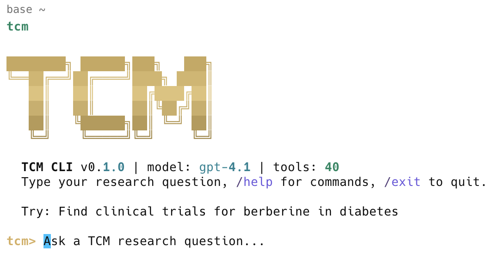

# tcm-cli



An autonomous agent for Traditional Chinese Medicine research and discovery.

Ask questions in natural language. tcm-cli plans the analysis, selects the right tools, executes them, validates results, and returns data-backed conclusions.

## Why tcm?

- **30+ TCM research tools** — Herb lookup, formula analysis, syndrome differentiation, network pharmacology, safety checks, literature search, and more.
- **Multi-model reasoning** — Powered by leading LLMs (Anthropic, OpenAI, Google Gemini, DeepSeek, Kimi, Qwen, MiniMax, Mistral, Groq, Cohere). Automatically plans multi-step research workflows, calls tools, and synthesizes findings.
- **Bilingual** — Supports both Chinese (中文) and English terminology throughout. See: [Language Modes](docs/LANGUAGE.md)
- **10+ database APIs** — PubMed, TCMSP, UniProt, STRING, KEGG, ClinicalTrials.gov, Open Targets — no setup required.
- **Research UX** — Interactive terminal with slash commands, session export, and clipboard support.
- **Open source** — MIT licensed.

## Requirements

- Python 3.10+
- An LLM API key (any one of: Anthropic, OpenAI, Google (Gemini), DeepSeek, Kimi (Moonshot), MiniMax, Qwen (DashScope), Mistral, Groq, Cohere)

## Installation

### Quick install (script)

```bash
curl -fsSL https://raw.githubusercontent.com/tigerneil/tcm-cli/main/install.sh | bash
```

The script detects `pipx`, `uv`, or falls back to `pip --user`, then runs `tcm setup`.

### With pipx (recommended)

```bash
pipx install tcm-cli
```

### With pip

```bash
# Core install
pip install tcm-cli

# With chemistry support (RDKit)
pip install "tcm-cli[chemistry]"

# With ML support (PyTorch + Transformers)
pip install "tcm-cli[ml]"

# With analysis stack (scikit-learn, seaborn, scipy)
pip install "tcm-cli[analysis]"

# Everything
pip install "tcm-cli[all]"
```

### Authentication

```bash
# Interactive setup wizard (Anthropic default)
 tcm setup

# Manage multiple providers (recommended)
 tcm keys                 # show status for all providers
 tcm keys set -p openai   # set OpenAI key (prompts securely)
 tcm keys set -p kimi     # set Moonshot Kimi key
 tcm keys set -p deepseek # set DeepSeek key
 tcm keys set -p google   # set Google (Gemini) key

# Or export directly (CI)
 export OPENAI_API_KEY="sk-..."
 export ANTHROPIC_API_KEY="..."
 export GOOGLE_API_KEY="..."

# Non-interactive (CI/scripting)
 tcm setup --api-key YOUR_ANTHROPIC_KEY
```

API keys are stored at `~/.tcm/config.json`. See provider mapping and base URLs in [docs/PROVIDERS.md](docs/PROVIDERS.md).

## Getting Started

### Basic usage

```bash
# Start interactive session
tcm

# Single query
tcm "What herbs are used for Spleen Qi deficiency?"

# Use a specific model
 tcm --model gpt-4o "Analyze 四君子汤"
 tcm --model gemini-3.1-pro "Check interactions between 人参 and 藜芦"

# Set language per run (English | Chinese | Bilingual)
tcm --lang en "Check interactions between 人参 and 藜芦"
tcm --lang zh "分析 四君子汤 的组成与配伍"
tcm --lang bi "Network pharmacology for 补中益气汤"

# Validate setup
tcm doctor
```

### Interactive commands

Inside `tcm` interactive mode:

- `/help` — command reference + examples
- `/tools` — list all tools with status
- `/model` — switch LLM model/provider
- `/lang` — set output language: `en` | `zh` | `bi`
- `/usage` — token and cost tracking
- `/copy` — copy last answer to clipboard
- `/export` — export session transcript
- `/clear` — clear screen
- `/exit` — exit

### Quick examples

**Herb lookup**

```
$ tcm "Tell me about 黄芪 (Astragalus) — properties, compounds, and clinical evidence"
```

**Formula analysis**

```
$ tcm "Analyze the composition of 四君子汤 using the 君臣佐使 framework"
```

**Syndrome differentiation**

```
$ tcm "Patient has fatigue, loose stools, poor appetite, pale tongue. What TCM syndrome?"
```

**Network pharmacology**

```
$ tcm "Build a network pharmacology analysis for 补中益气汤 against diabetes targets"
```

**Safety check**

```
$ tcm "Check interactions between 人参, 藜芦, and Warfarin"
```

## Language modes

You can control the language of answers globally or per-run.

- Per run: `--language`/`--lang` with `en` | `zh` | `bi`
- Interactive: `/lang en|zh|bi`
- Persist default: `tcm config set ui.language bi`

Behavior by mode:
- `en`: English-only output with occasional pinyin for key TCM terms
- `zh`: 中文输出，不含英文（除非作为引用）
- `bi`: Bilingual — paired headings (e.g., "## 关键信息 | Key Findings") and aligned bullet points

## Documentation

- Language Modes: see [docs/LANGUAGE.md](docs/LANGUAGE.md)
- Providers, keys, and base URLs: see [docs/PROVIDERS.md](docs/PROVIDERS.md)
- Changelog: see [CHANGELOG.md](CHANGELOG.md)

## Key Features

### 30+ Domain Tools

| Category | Examples |
| --- | --- |
| **Herbs** | Lookup, property classification, meridian search, compound listing |
| **Formulas** | Classical formula search, 君臣佐使 analysis, modifications |
| **Syndromes** | Pattern differentiation, symptom-to-syndrome mapping, treatment plans |
| **Compounds** | Active compound search, ADMET prediction, target identification |
| **Pharmacology** | Network pharmacology, pathway enrichment, herb-target networks |
| **Interactions** | 十八反/十九畏 checks, herb-drug interactions, formula safety |
| **Literature** | PubMed search, systematic review finder, CNKI integration |
| **Meridians** | Channel lookup, Five Element associations, meridian-herb mapping |
| **Safety** | Toxicity profiling, pregnancy safety, dosage validation |
| **Modern** | Clinical trial search, ICD-10 mapping, evidence summaries |
| **Data APIs** | TCMSP, UniProt, STRING, KEGG, ClinicalTrials.gov, Open Targets |
| **Code** | Python sandbox for custom analysis (experimental) |

List all tools and their status:

```bash
tcm tool list
```

### Supported providers and models

Out of the box, tcm-cli can talk to these providers (pick any one):

- Anthropic: `claude-sonnet-4-5-20250929` (default), `claude-haiku-4-5-20251001`, `claude-opus-4-6`
- OpenAI: `gpt-4o`, `gpt-4o-mini`, `o3-mini`, `gpt-4.1*`
- DeepSeek: `deepseek-v3.2`, `deepseek-r1`
- Kimi (Moonshot): `kimi-k2.5`
- MiniMax: `minimax-m2.5`
- Qwen (DashScope): `qwen3-max`, `qwen-plus`
- Google (Gemini): `gemini-2.5-flash` (default), `gemini-2.5-pro`, `gemini-2.5-flash-lite`, `gemini-2.0-flash`, `gemini-2.0-flash-lite`, `gemini-3.1-pro-preview`, `gemini-3-pro-preview`
- Mistral: `mistral-large-latest`
- Groq: `llama-3.1-70b-versatile`
- Cohere: `command-r-plus`

Tip: Use the interactive picker `/model` in the REPL, or CLI commands below.

```bash
tcm model list                    # Show all models grouped by provider with context/pricing
tcm model set gpt-4o              # Switch to a model (provider auto-detected)
tcm model set kimi-k2.5           # Switch to Moonshot Kimi
tcm model set gemini-2.5-flash    # Switch to Gemini 2.5 Flash
tcm model set gemini-2.5-pro      # Switch to Gemini 2.5 Pro (most capable)
tcm model set gemini-3.1-pro-preview  # Switch to Gemini 3.1 Pro Preview (frontier)
tcm model google                  # List ALL available Gemini models live from the API
tcm model show                    # Show current model
```

See provider keys and base URLs: [docs/PROVIDERS.md](docs/PROVIDERS.md).

### Local Datasets

Without local data, tcm works via database APIs and built-in knowledge. To boost accuracy and offline support, install local datasets:

```bash
tcm data pull herbs      # Install bundled herb monograph data (instant)
tcm data pull formulas   # Install bundled classical formula data (instant)
tcm data pull tcmsp      # TCMSP — herbs, compounds, targets (~50 MB)
tcm data pull tcmid      # TCMID — herb-compound-disease (~30 MB)
tcm data pull batman     # BATMAN-TCM bioinformatics data (~100 MB)
tcm data pull symmap     # SymMap symptom-mapping database (~20 MB)
tcm data status          # Show all dataset statuses
```

**Install modes:**
- `herbs` and `formulas` install instantly from bundled package data.
- Datasets with a direct download URL are fetched automatically with a progress bar and extracted.
- Datasets that require registration (tcmsp, tcmid, batman, symmap) print step-by-step instructions. After downloading manually, register the file:

```bash
tcm data import tcmsp ~/Downloads/tcmsp.zip
tcm data import tcmsp ~/Downloads/tcmsp-extracted/   # or a directory
```

Use `--force` to re-download or reinstall any dataset:

```bash
tcm data pull herbs --force
```

## Configuration

```bash
tcm config show             # Show all settings
tcm config set key value    # Set a value
tcm config get key          # Get a single value
tcm config validate         # Check for issues
```

Config is stored at `~/.tcm/config.json`.

### Common config keys

```bash
tcm config set llm.provider openai           # switch to OpenAI
tcm config set llm.model gpt-4o             # set model (provider auto-detected)
tcm config set llm.provider google          # switch to Google (Gemini)
tcm config set llm.model gemini-2.5-flash   # set Gemini 2.5 Flash as default
tcm config set ui.language bi               # en (default) | zh | bi
```

### Agent profiles

```bash
tcm config set agent.profile research    # Default — balanced, allows hypotheses
tcm config set agent.profile clinical    # Strict evidence only, no hypotheses
tcm config set agent.profile education   # Relaxed, creative responses
```

## Troubleshooting

| Symptom | Fix |
| --- | --- |
| `tcm` fails at startup | `tcm doctor` |
| Authentication error | `tcm setup` or `tcm keys` |
| Missing API key | `export OPENAI_API_KEY=...` or `tcm config set llm.openai_api_key ...` |
| Google model 404 | Run `tcm model google` to see valid model IDs, then `tcm model set <id>` |
| Google SSL/connect error | Transient network issue, retry or switch to another model |
| Missing dependency | `pip install "tcm-cli[all]"` |
| Tool module failed | `tcm tool list` — check for load errors |

## Contributing

```bash
git clone https://github.com/tigerneil/tcm-cli.git
cd tcm-cli
pip install -e ".[dev]"
tcm setup
pytest tests/
```

## License

MIT
